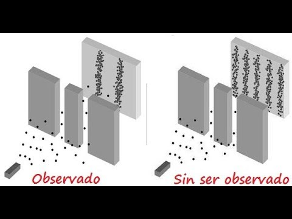
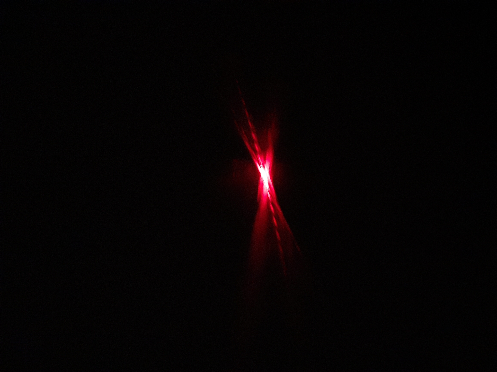
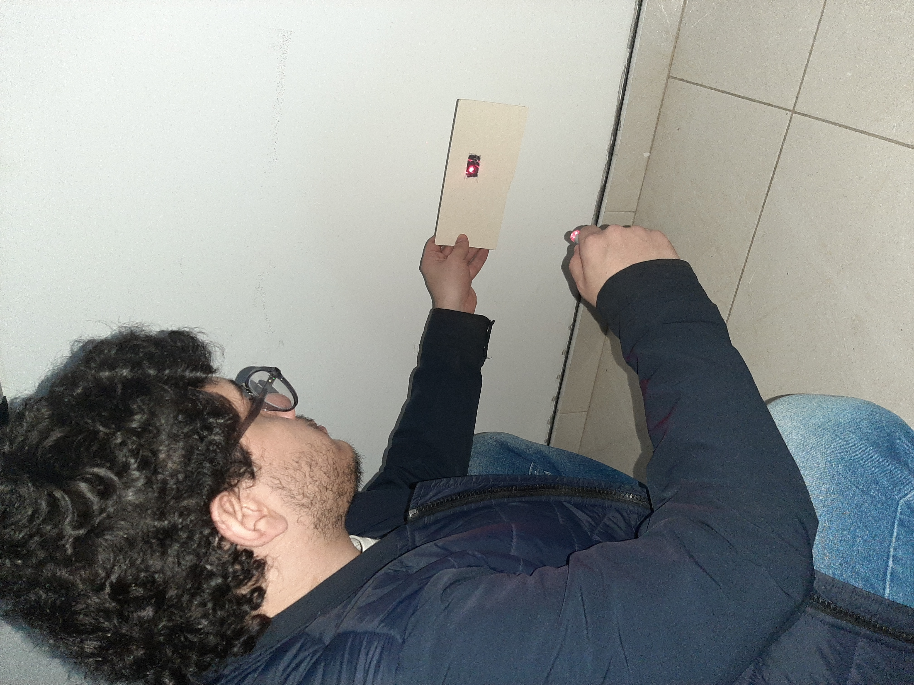

# DobleRendija-CNYT

## Descripción

En este espacio recrearemos el ya conocido experimento de la doble rendija el cual nos permite explicar un fenomeno muy curioso de la fisica cuantica, este consta de fotones atravesando dos rendijas logrando así el efecto al que se trata de llegar (el cual colocaré una imagen abajo), se desarrollo un video y se tomaron fotos para explicarlo un poco mejor y ver peculiaridades con este

## Explicación 

Este experimento dejo impactado a los cientificos del mundo ya que tiene una curiosidad única, por primero pensemos en dos experimentos que realizaremos:
1. Imaginemos las dos rendijas y vamos soltando foton por foton, estas se van alumbrando en una pared que esta adelante y colocaremos un detector en cada rendija asi saber por cual excatamente esta pasando, efectivamente cuando pasa por una el detector un lado avisa y el otro se queda apagado así repetidamente ocurre a lo largo del experimento, esto hace que la pantalla de adelante sólo se vean las figuras de las dos rendijas, esto era de esperarse creo que todo el mundo que ve por primera vez este experimento sabía que iba a ocurrir esto mismo. [Ver imagen de arriba "observado"]
2. Ahora realizaremos el mismo montaje pero esta vez no colocaremos los detectores (ya no sabemos exactamente por cual rendija esta saliendo el foton), acá uno diría vale no hay problema va a suceder lo mismo que el experimento anterior pero ocurre la curiosidad de que en la pantalla de adelante no se dibuja el mismo patron que el anterior sino que se ve un patron de interferencia bastante curioso en el cual hay varios pedazos donde llegan los puntos separados por espacios en blanco donde no llegan estos mismos. [Ver imagen de arriba "sin ser observado"]

Al ver lo que esta ocurriendo no podemos afirmar exactamente por cual de las dos rendijas esta pasando por ende debemos asegurar que el foton esta pasando por las dos rendijas así logrando tener dos estados al mismo tiempo lo que nos abre las puertas de lo que conocemos como el multiverso, el cual la fisica cuantica se encarga de describir y podemos retratarlo en experimentos tan sencillos como este que estamos realizando

## Libreria

**asd**

## Video

## Imagenes

## 
